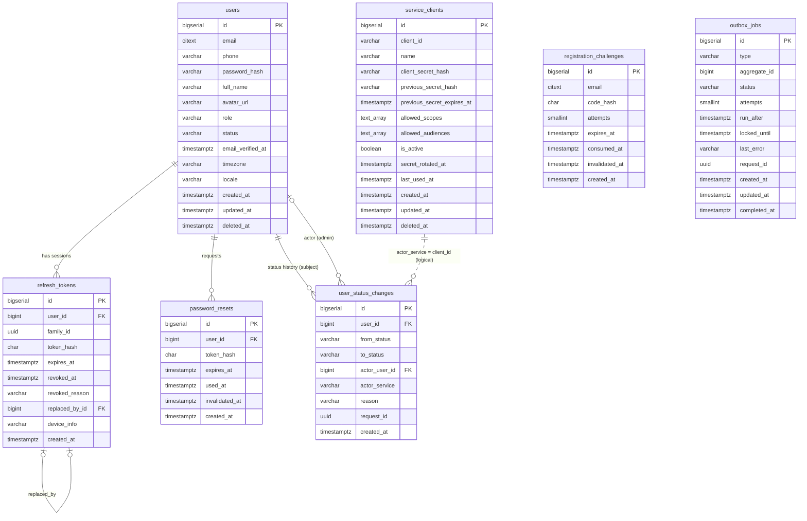

# Data Model

Planned schema for the identity PostgreSQL database. Tables are created **by the module that needs
them, when it is built** (raw-SQL Knex migrations, `write-migration` skill) — none exist yet. Every rule
here comes from CLAUDE.md → Database rules; when a migration is written, this page is reconciled with it.

**2026-09-15 baseline** ([design-baseline.md](./design-baseline.md)): `email_verifications` removed
(ADR 0006); `registration_challenges` and `outbox_jobs` added (ADR 0006, ADR 0007); `password_resets` token
columns are set by the worker at send time. Sizes: [capacity.md](./capacity.md).

## Conventions applied to every table
- PK `id BIGSERIAL`; FK columns `BIGINT`, each FK named `fk_<table>_<col>` and covered by an index whose
  leading column is the FK column.
- Every timestamp is `TIMESTAMPTZ` (UTC; pool runs `SET TIME ZONE 'UTC'`).
- Enum-like columns: `VARCHAR(n) NOT NULL CHECK (col IN (...))`, constraint `chk_<table>_<what>`.
- No defaults on `role` or `status` — the service always sets them.
- Secrets are hashes only: argon2id for passwords and client secrets; sha256 (hex, `CHAR(64)`) for
  256-bit random tokens.
- Soft delete via `deleted_at` on business tables; uniqueness among live rows via partial unique indexes.
  Token and history tables are append/revoke-only (no `deleted_at`; they are never user-deletable and
  expired rows are purged by a background job, never in a request).
- Every index exists for a named query; composite order is equality columns, then range/sort column.
- Required extension: `citext`.

## ERD

---

## `users`
The account. Single writer: identity-service.

| Column | Type | Null | Constraint / notes |
|---|---|---|---|
| `id` | `BIGSERIAL` | no | `PRIMARY KEY`; exposed as numeric id (hub ADR 0004) |
| `email` | `CITEXT` | no | unique among live rows (`uq_users_email`); never changed in MVP |
| `phone` | `VARCHAR(16)` | yes | E.164; `chk_users_phone_e164` (`phone ~ '^\+[1-9][0-9]{7,14}$'`) |
| `password_hash` | `VARCHAR(255)` | no | argon2id encoded string (legacy `$2b$` bcrypt accepted until rehash) |
| `full_name` | `VARCHAR(120)` | no | `chk_users_full_name_not_blank` (`length(btrim(full_name)) > 0`) |
| `avatar_url` | `VARCHAR(2048)` | yes | |
| `role` | `VARCHAR(16)` | no | `chk_users_role` `IN ('patient','doctor','admin')`; no default |
| `status` | `VARCHAR(16)` | no | `chk_users_status` `IN ('pending','active','suspended','rejected')`; no default |
| `email_verified_at` | `TIMESTAMPTZ` | yes | set once; drives the `ev` claim |
| `timezone` | `VARCHAR(64)` | no | IANA zone, validated in the DTO |
| `locale` | `VARCHAR(35)` | no | BCP-47 tag, validated in the DTO |
| `created_at` | `TIMESTAMPTZ` | no | `DEFAULT now()` |
| `updated_at` | `TIMESTAMPTZ` | no | `DEFAULT now()`; set by the repository on every update |
| `deleted_at` | `TIMESTAMPTZ` | yes | soft delete; frees the email for re-registration |

| Index | Definition | Query it serves |
|---|---|---|
| `uq_users_email` | `UNIQUE (email) WHERE deleted_at IS NULL` | login / `register/start` / `register/complete` / forgot-password lookup `WHERE email = $1 AND deleted_at IS NULL`; admin `GET /api/users?email=` |
| `idx_users_created_at_id` | `(created_at DESC, id DESC) WHERE deleted_at IS NULL` | `GET /api/users` default keyset page with no filters |
| `idx_users_role_created_at_id` | `(role, created_at DESC, id DESC) WHERE deleted_at IS NULL` | `GET /api/users?role=` keyset page |
| `idx_users_status_created_at_id` | `(status, created_at DESC, id DESC) WHERE deleted_at IS NULL` | `GET /api/users?status=` keyset page (e.g. admin reviewing `suspended`) |

Lookups by id (`GET /api/users/{id}`, `/internal/users?ids=` via `WHERE id = ANY($1) AND deleted_at IS NULL`)
use the primary key; no extra index.

## `refresh_tokens`
One row per issued refresh token. A **family** is the chain of rotations started by one login.

| Column | Type | Null | Constraint / notes |
|---|---|---|---|
| `id` | `BIGSERIAL` | no | `PRIMARY KEY` |
| `user_id` | `BIGINT` | no | `fk_refresh_tokens_user_id` → `users(id)` |
| `family_id` | `UUID` | no | generated at login; shared by every rotation |
| `token_hash` | `CHAR(64)` | no | sha256 hex of the 256-bit opaque token; `uq_refresh_tokens_token_hash` |
| `expires_at` | `TIMESTAMPTZ` | no | issue time + `REFRESH_TOKEN_TTL_DAYS` |
| `revoked_at` | `TIMESTAMPTZ` | yes | |
| `revoked_reason` | `VARCHAR(32)` | yes | `chk_refresh_tokens_revoked_reason` `IN ('rotated','reuse_detected','logout','password_changed','password_reset','status_changed','admin_revoked','account_deleted')`; `chk_refresh_tokens_revoked_pair` (`(revoked_at IS NULL) = (revoked_reason IS NULL)`) |
| `replaced_by_id` | `BIGINT` | yes | `fk_refresh_tokens_replaced_by_id` → `refresh_tokens(id)`; set when `revoked_reason='rotated'` |
| `device_info` | `VARCHAR(255)` | yes | truncated User-Agent; never an IP or PII beyond this |
| `created_at` | `TIMESTAMPTZ` | no | `DEFAULT now()` |

| Index | Definition | Query it serves |
|---|---|---|
| `uq_refresh_tokens_token_hash` | `UNIQUE (token_hash)` | refresh/logout lookup `WHERE token_hash = $1` (includes revoked rows so reuse is detectable) |
| `idx_refresh_tokens_user_id_live` | `(user_id) WHERE revoked_at IS NULL` | `GET /api/users/{id}/sessions` (live tokens of one user); also the live-row part of revoke-all `UPDATE … WHERE user_id = $1 AND revoked_at IS NULL` (as built in `20261007000200`) |
| `idx_refresh_tokens_family_id_created_at` | `(family_id, created_at, id)` | session `createdAt`: earliest retained token of a family, `ORDER BY created_at, id LIMIT 1` (`GET /api/users/{id}/sessions`) |
| `idx_refresh_tokens_family_id_live` | `(family_id) WHERE revoked_at IS NULL` | revoke a family (logout, reuse detection) `UPDATE … WHERE family_id = $1 AND revoked_at IS NULL` |
| `idx_refresh_tokens_replaced_by_id` | `(replaced_by_id) WHERE replaced_by_id IS NOT NULL` | covers `fk_refresh_tokens_replaced_by_id` |
| `idx_refresh_tokens_expires_at` | `(expires_at)` | background purge of rows expired beyond retention `WHERE expires_at < $1` |

`idx_refresh_tokens_user_id_live` has `user_id` as leading column; a full FK-covering index is
`idx_refresh_tokens_user_id` `(user_id)` (needed because the partial index does not cover revoked rows
for `ON DELETE` checks and account-deletion revocation audits).

## `password_resets`
| Column | Type | Null | Constraint / notes |
|---|---|---|---|
| `id` | `BIGSERIAL` | no | `PRIMARY KEY` |
| `user_id` | `BIGINT` | no | `fk_password_resets_user_id` → `users(id)` |
| `token_hash` | `CHAR(64)` | yes | sha256 hex; **NULL until the worker sends the email** (ADR 0007); `uq_password_resets_token_hash`; `chk_password_resets_token_sent` (`(token_hash IS NULL) = (expires_at IS NULL)`) |
| `expires_at` | `TIMESTAMPTZ` | yes | send time + 30 min (set by the worker with `token_hash`) |
| `used_at` | `TIMESTAMPTZ` | yes | single use |
| `invalidated_at` | `TIMESTAMPTZ` | yes | set when a newer reset token is issued |
| `created_at` | `TIMESTAMPTZ` | no | `DEFAULT now()` |

| Index | Definition | Query it serves |
|---|---|---|
| `uq_password_resets_token_hash` | `UNIQUE (token_hash) WHERE token_hash IS NOT NULL` | `POST /api/auth/reset-password` lookup `WHERE token_hash = $1` |
| `idx_password_resets_user_id_open` | `(user_id) WHERE used_at IS NULL AND invalidated_at IS NULL` | invalidate earlier unused tokens on `forgot-password`; covers the FK |
| `idx_password_resets_expires_at` | `(expires_at)` | background purge |

The FK-covering rule is satisfied for `password_resets` by an additional plain
`idx_password_resets_user_id (user_id)` index, because the partial index excludes used rows.

## `registration_challenges`
Proof of email ownership before an account exists (ADR 0006). Replaces `email_verifications`.

| Column | Type | Null | Constraint / notes |
|---|---|---|---|
| `id` | `BIGSERIAL` | no | `PRIMARY KEY` |
| `email` | `CITEXT` | no | no FK — the account does not exist yet |
| `code_hash` | `CHAR(64)` | yes | HMAC-SHA256(`OTP_PEPPER`, 6-digit code), hex; NULL until the worker sends; `chk_registration_challenges_code_sent` (`(code_hash IS NULL) = (expires_at IS NULL)`) |
| `attempts` | `SMALLINT` | no | `chk_registration_challenges_attempts` (`attempts BETWEEN 0 AND 5`); set explicitly to 0 on insert |
| `expires_at` | `TIMESTAMPTZ` | yes | send time + 10 min |
| `consumed_at` | `TIMESTAMPTZ` | yes | set by a successful `register/complete` in the same transaction as the `users` insert |
| `invalidated_at` | `TIMESTAMPTZ` | yes | set by a newer `register/start` for the same email, or on the 5th failed attempt |
| `created_at` | `TIMESTAMPTZ` | no | `DEFAULT now()` |

| Index | Definition | Query it serves |
|---|---|---|
| `idx_registration_challenges_email_open` | `(email, created_at DESC) WHERE consumed_at IS NULL AND invalidated_at IS NULL` | `register/complete`: latest open challenge `WHERE email = $1 … ORDER BY created_at DESC LIMIT 1 FOR UPDATE`; `register/start`: invalidate open challenges for the email |
| `idx_registration_challenges_created_at` | `(created_at)` | worker purge `WHERE created_at < now() - interval '24 hours'` |

"Account already exists" notices create no challenge row — only an outbox job pointing at the user id.

## `outbox_jobs`
Transactional outbox processed by `identity-worker` (ADR 0007). Rows hold ids only — **no PII, no secrets**.

| Column | Type | Null | Constraint / notes |
|---|---|---|---|
| `id` | `BIGSERIAL` | no | `PRIMARY KEY` |
| `type` | `VARCHAR(48)` | no | `chk_outbox_jobs_type` `IN ('send_registration_code','send_account_exists_notice','send_password_reset')`; extended by migration for future events |
| `aggregate_id` | `BIGINT` | no | `registration_challenges.id`, `users.id`, or `password_resets.id` depending on `type` (logical reference, no FK) |
| `status` | `VARCHAR(16)` | no | `chk_outbox_jobs_status` `IN ('pending','processing','done','dead')`; set explicitly |
| `attempts` | `SMALLINT` | no | `chk_outbox_jobs_attempts` (`attempts >= 0`); `dead` after `OUTBOX_MAX_ATTEMPTS` |
| `run_after` | `TIMESTAMPTZ` | no | next eligible attempt (backoff) |
| `locked_until` | `TIMESTAMPTZ` | yes | lease while `processing`; expired leases are re-claimed |
| `last_error` | `VARCHAR(500)` | yes | error class/code only — never provider bodies, emails, or secrets |
| `request_id` | `UUID` | no | originating `X-Request-Id` |
| `created_at` | `TIMESTAMPTZ` | no | `DEFAULT now()` |
| `updated_at` | `TIMESTAMPTZ` | no | `DEFAULT now()`; set on every state change |
| `completed_at` | `TIMESTAMPTZ` | yes | set when `done` or `dead` |

| Index | Definition | Query it serves |
|---|---|---|
| `idx_outbox_jobs_run_after_pending` | `(run_after) WHERE status = 'pending'` | worker claim `WHERE status='pending' AND run_after <= now() ORDER BY run_after LIMIT $n FOR UPDATE SKIP LOCKED` |
| `idx_outbox_jobs_locked_until_processing` | `(locked_until) WHERE status = 'processing'` | re-claim jobs whose lease expired |
| `idx_outbox_jobs_completed_at` | `(completed_at) WHERE status IN ('done','dead')` | purge `done` after 7 days and `dead` after 30 days |

## `service_clients`
Registered callers of `/internal/*`. Provisioned by an ops procedure, never via an API.

| Column | Type | Null | Constraint / notes |
|---|---|---|---|
| `id` | `BIGSERIAL` | no | `PRIMARY KEY` |
| `client_id` | `VARCHAR(64)` | no | e.g. `care-service`; `chk_service_clients_client_id` (`client_id ~ '^[a-z][a-z0-9-]{2,63}$'`); unique among live rows |
| `name` | `VARCHAR(120)` | no | human label; `chk_service_clients_name_not_blank` (`length(btrim(name)) > 0`) |
| `client_secret_hash` | `VARCHAR(255)` | no | argon2id; plaintext shown once at provisioning; `chk_service_clients_secret_hash_argon2id` (`LIKE '$argon2id$%'`) |
| `previous_secret_hash` | `VARCHAR(255)` | yes | the superseded argon2id hash during a rotation overlap; `chk_service_clients_previous_hash_argon2id` (NULL or `LIKE '$argon2id$%'`) |
| `previous_secret_expires_at` | `TIMESTAMPTZ` | yes | end of the overlap; `chk_service_clients_previous_secret_pair` (`(previous_secret_hash IS NULL) = (previous_secret_expires_at IS NULL)`) |
| `allowed_scopes` | `TEXT[]` | no | `chk_service_clients_allowed_scopes` (`allowed_scopes <@ ARRAY['users:read','users:status:write','doctors:read']::text[]`); `chk_service_clients_allowed_scopes_nonempty` (`cardinality(allowed_scopes) >= 1`) |
| `allowed_audiences` | `TEXT[]` | no | e.g. `{vcare-identity,vcare-care}`; `chk_service_clients_allowed_audiences_shape` (non-empty, every element `vcare-[a-z0-9-]+`, no NULL elements) |
| `is_active` | `BOOLEAN` | no | no default (provisioning SQL sets it); disabled clients get `401 InvalidCredentials`; tokens already issued live until `exp` (<= 300 s) |
| `secret_rotated_at` | `TIMESTAMPTZ` | yes | set by `--rotate` |
| `last_used_at` | `TIMESTAMPTZ` | yes | updated at most once per minute per client, asynchronously after the response (outside the hot path budget) |
| `created_at` | `TIMESTAMPTZ` | no | `DEFAULT now()` |
| `updated_at` | `TIMESTAMPTZ` | no | `DEFAULT now()`; ops statements set it explicitly |
| `deleted_at` | `TIMESTAMPTZ` | yes | soft delete; frees the `client_id` |

| Index | Definition | Query it serves |
|---|---|---|
| `uq_service_clients_client_id` | `UNIQUE (client_id) WHERE deleted_at IS NULL` | `POST /internal/auth/token` lookup `WHERE client_id = $1 AND deleted_at IS NULL` |

During secret rotation a client holds two valid hashes (`previous_secret_hash` with
`previous_secret_expires_at`, set and cleared together). The token endpoint accepts the previous hash only while
`previous_secret_expires_at` is in the future; an expired pair is simply ignored (it is not auto-cleared; the next
`--rotate` overwrites it). See [service-auth.md](./service-auth.md) section 8 and ADR 0022. Application code only
reads the table and touches `last_used_at`; rows are created, rotated and disabled by ops SQL
(`scripts/provision-service-client.ts`, [runbook.md](../runbook.md)). Built by migration
`20261007000300_create_service_clients`.

## `user_status_changes`
Append-only history of every change to `users.status`, written **in the same transaction** as the change.
Satisfies PRD §7.12 audit for account status on the Identity side.

| Column | Type | Null | Constraint / notes |
|---|---|---|---|
| `id` | `BIGSERIAL` | no | `PRIMARY KEY` |
| `user_id` | `BIGINT` | no | `fk_user_status_changes_user_id` → `users(id)` |
| `from_status` | `VARCHAR(16)` | no | `chk_user_status_changes_from_status` (same set as `users.status`) |
| `to_status` | `VARCHAR(16)` | no | `chk_user_status_changes_to_status`; `chk_user_status_changes_differs` (`from_status <> to_status` — idempotent no-ops write no row) |
| `actor_user_id` | `BIGINT` | yes | `fk_user_status_changes_actor_user_id` → `users(id)`; the admin (from the token on the public route, from the body on the internal route — recorded as data only) |
| `actor_service` | `VARCHAR(64)` | yes | service token `sub` (e.g. `care-service`); null for public admin changes |
| `reason` | `VARCHAR(500)` | no | |
| `request_id` | `UUID` | no | the `X-Request-Id`, so one trace spans Care and Identity |
| `created_at` | `TIMESTAMPTZ` | no | `DEFAULT now()` |

`chk_user_status_changes_actor` requires `actor_user_id IS NOT NULL OR actor_service IS NOT NULL`.
Registration's initial status is not a change and writes no row.

| Index | Definition | Query it serves |
|---|---|---|
| `idx_user_status_changes_user_id_created_at` | `(user_id, created_at DESC)` | status history for a user (admin/support investigation); covers the FK |
| `idx_user_status_changes_actor_user_id` | `(actor_user_id) WHERE actor_user_id IS NOT NULL` | covers `fk_user_status_changes_actor_user_id`; "what did this admin change" audit |

---

## Redis keys (non-durable)
| Key | TTL | Purpose |
|---|---|---|
| `idem:{route}:{principal-or-ip}:{key}` | 24 h | idempotency record: body hash, status, response body |
| `rl:{limiter}:{subject}` | window length | sliding-window counters (see [infrastructure.md](./infrastructure.md)) |

## Retention
All purges run in `identity-worker` under an advisory lock, in batches (never in a request):

| Table | Purged when |
|---|---|
| `refresh_tokens` | 30 days after `expires_at` or `revoked_at` |
| `password_resets` | 30 days after `used_at`, `invalidated_at`, or `expires_at` (unsent rows: 30 days after `created_at`) |
| `registration_challenges` | 24 h after `created_at` |
| `outbox_jobs` | `done` 7 days, `dead` 30 days after `completed_at` |
| `user_status_changes` | never — retained for the life of the account and beyond soft delete |
| `users` | never hard-deleted; **PII is kept on soft delete in MVP** (ADR 0011) |
